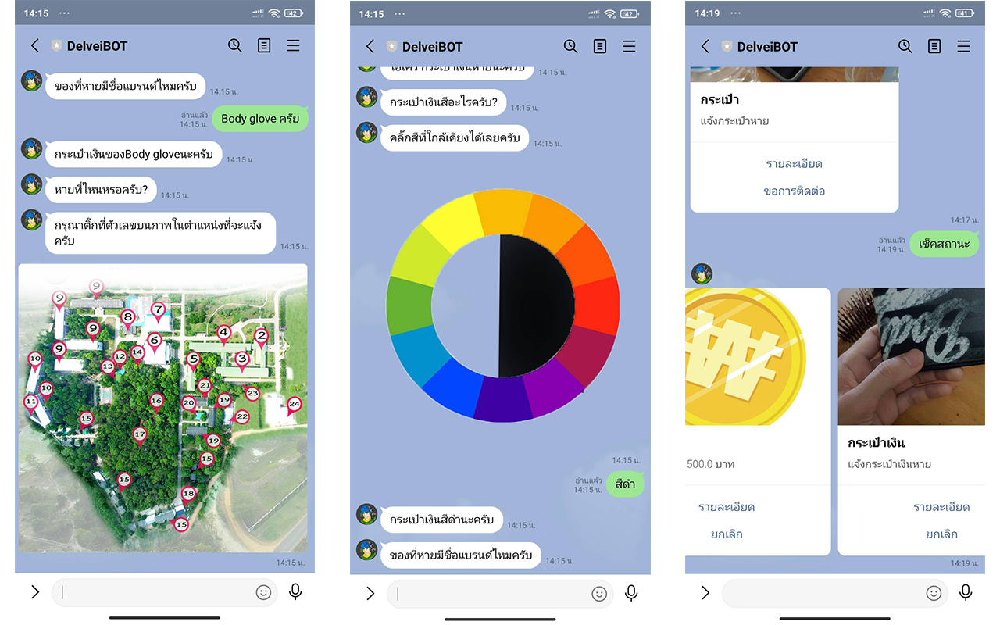
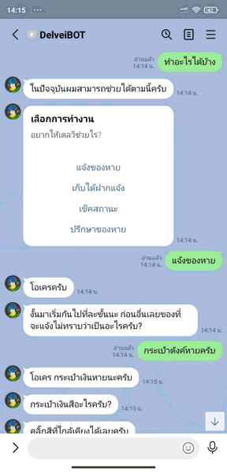

# DelveiBot
Chat bots comunicate between who have lost someting and who found someting. Now, av

## Getting Started
## Requires
* Line develop account
* ngrok (localhost)
* Dialogflow
* mongoDB


### Install library
```shell
$ pip3 install -r requirements.txt 
```

### Configulation
```cd app/config.py```
| variable | Description |
| ------ | ----------- |
| root_path  | URL path for accessing route. |
| image_path | Relative path of image folder. |
| credential_path |  credentrial Dialogflow key. |
| project_id | Project ID of Dialogflow agent. |
| Channel_access_token | Your own Line Channel access token |
| Channel_secret | Your own Channel secret |

### How to run
* ```cd app/``` then run code below.
```shell
$ pip app.py 
```
* open ngrok ```ngrok.exe``` then run code below.
```shell
$ ngrok http port 300
```
* copy url path and connect with line webhook. For example ```https://911f1c3208b9.ngrok.io```

## Results


